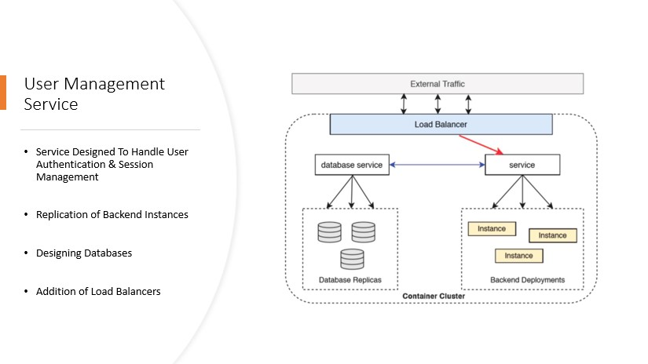

# Blockchain based Electronic Voting System

**Abstract**

With the emergence of modern technologies like distributed ledger, decentralized computing using containerization and storage offers a robust e-voting system. Online voting system might seem like default option in this online world of internet banking, shopping, and all. However, they present different challenges which do not apply to other online processes. The paper describes a system design architecture that uses container technology and blockchain technology to deliver distributed decentralized framework which relies on trust and transparency.

**Background and related work**

 - Many electronic voting systems have been proposed in the past, each with its own design to meet the functional requirements while taking care of security, voter privacy and legal frameworks. 
 - Estonia was the first nation to hold legal general elections over the internet with their pilot project for municipal elections in 2005. But the system was not secure in transmitting voted ballots electronically. 
 - Similarly, Washington DC had a trail of their electronic voting system in 2010. It used traditional database and encryption, but the server is open to attacks before encrypting the ballot data. In the literature survey, we did not find a traditional voting system which delivers robust data confidentiality and user Confidence.

  

## How it works

* It allows applications to consistently operate regardless of the environment or operating system.

* Two main Linux Kernel features that allowed the emergence of this technology are:
* Cgroups, namespaces

### Architecture

The proposed system architecture provides secure transactions, data security and trust. The design is divided into three main parts as follows:
* User Management Service
This handles the voter enrollment and authentication with data security. The backend service-based architecture uses container based distributed framework to provide module abstraction and load balancing for scalability and fault tolerant system. The network provides service abstraction layer for any external attacks
* Blockchain Invocation and Querying Service
After the enrollment, the actor gets a set of credentials and marked as a valid actor in the blockchain network. A smart contract is designed to interact and submit transactions to the blockchain network.
* Blockchain Network
The blockchain network is made up of decentralized nodes with no central authority to control. The nodes collaborate to have a consensus among themselves where all nodes agree. Depending on the smart contracts on each node, the node then uploads the transaction to the blockchain.

## Technologies Used

Auto-generation programming Tool uses a number of technologies to work properly:

* [Amazon Lambda](https://aws.amazon.com/lambda/) - serverless compute service that runs your code in response to events.
* [Amazon S3 Bucket](https://aws.amazon.com/s3/) - public cloud storage resource available in Amazon Web services.
* [Amazon Polly](https://aws.amazon.com/polly/) -Amazon Polly is a cloud service by Amazon Web Services, a subsidiary of Amazon.com, that converts text into lifelike speech
* [REST API](https://restfulapi.net/) -Representational state transfer is a software architectural style that defines a set of constraints to be used for creating Web services. Web services that conform to the REST architectural style
* [JSON](https://en.wikipedia.org/wiki/JSON)-an open standard file format, and data interchange format, that uses human-readable text to store and transmit data objects consisting of attribute–value pairs and array data types
* [Amazon Lex](https://aws.amazon.com/lex/)- service for building conversational interfaces into any application using voice and text

## Conclusion

 - Voter identity verification is achieved while keeping the identity anonymous to protect personnel rights and privacy.
 - Blockchain network provides integrity of confidential data like ballot is guaranteed. 
 - A distributed containerized system offers distributed computation with system integration and secure framework.